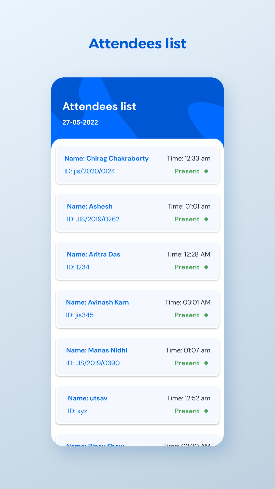
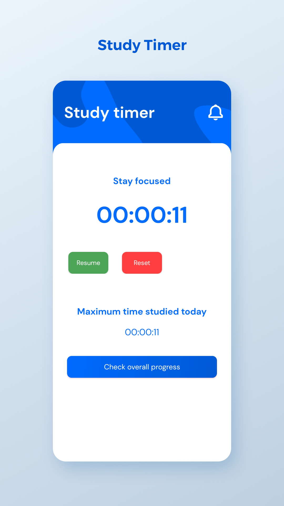

iFaceCount - intelligent face count system
This is an Android Application developed for Microsoft Intern Engage 2022 Programme. 
It's an Smart Attendance App that is powered by face recognition technology. 
The UI/UX is really simple and self explanatory, the user will not face any issues. 

## 💻 Tech Stack used 
- **Java** - Developed using Android studio and Java as developing Language
- **XML** - To implement design into code
- **Firebase** - To authenticate users, store user's data and perform operations and store files (PDFs)
- **ML Kit** - To detect faces in the application [ML Kit - Firebase](https://developers.google.com/ml-kit)
- **TensorFlow Lite** - To recognize Faces [TensorFlow Lite](https://www.tensorflow.org/lite)
- **Pre-Trained model** - [MobileFaceNet](https://github.com/sirius-ai/MobileFaceNet_TF)
- **CameraX** - To capture faces and recognize using camera preview [CameraX](https://developer.android.com/training/camerax)

## ✨ Features
- **Face Recognition** - Makes it an MVP app
- **Attendees list** - Shows a list of attendees that are present on that particular day
- **Progress** - To check the monthly attendance progress and consistency
- **PDF** - Admin can add PDFs and anyone can download it, comes in handy when sharing important pdfs, previours year papers and so on
- **Study timer** - This needs the DND Access, it's a timer that monitors how long you study and turns on silent mode when started
- **Study progress** - This shows how long you studied each day for the past 7 days and this helps your to check your progress
- **Settings/Profile/Edit profile** - Check your current details and also get the access to edit your profile.

## 📱Screenshots
||||
|:----------------------------------------:|:-----------------------------------------:|:-----------------------------------------: |
|   |  |
|  |  |  |

## 🤔 How it works?
- Intialially during registration the user's face embeddings is stored in a HashMap as value with a key that is same of all users "added". 
- Then after signin in, the key "added" is replaced with the userID -> <UserID, Embeddings> and stored in the user's Node 
- These node from users is then used during facial recognition 
- During facial recognition, the embeddings obtained from the person in the camera is used to calculate the euclidean distance between the person and the list of embeddings in the Firebase   RealTime Database. 
- If the distance is less than 1.0f and also the Key -> userID of the same hashmap is matched with the current logged in userID then it is success, the attendance is marked. 
